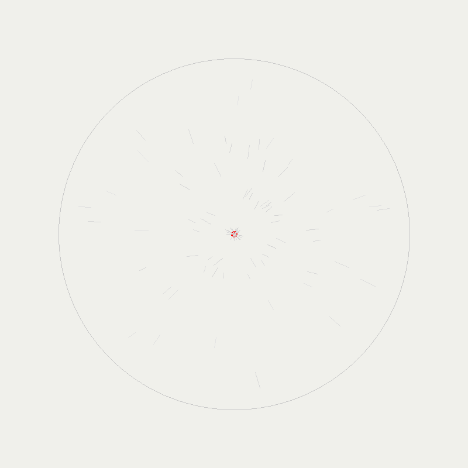
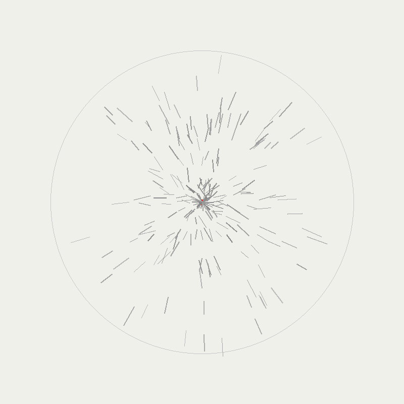
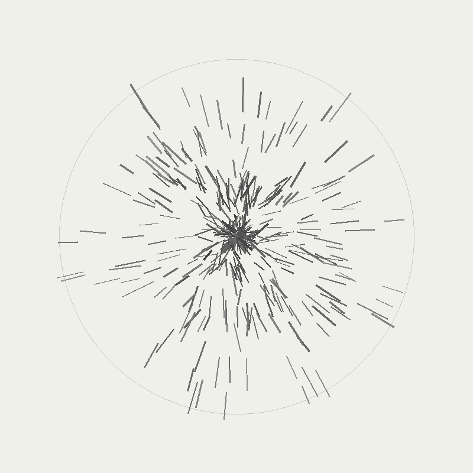
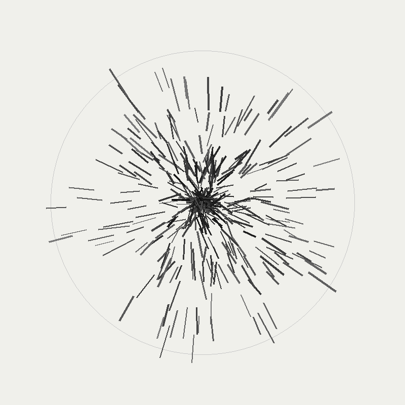
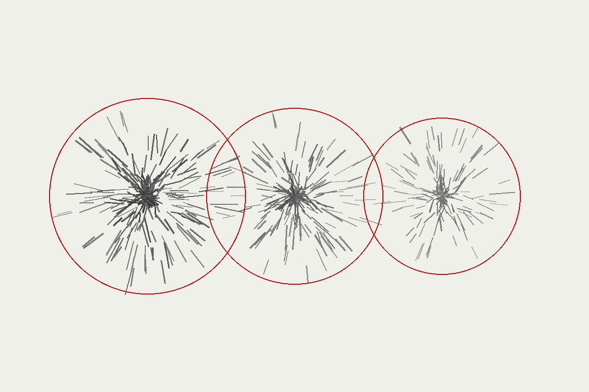

# Manifestation Rendering Tests

## Low Density (0.2)

- **Shards:** 96
- **File Size:** 9.3 KB
- **Description:** Sparse manifestation field with minimal metal shard formations

## Medium Density (0.5)

- **Shards:** 231
- **File Size:** 17.4 KB
- **Description:** Moderate manifestation field showing increased shard density

## High Density (0.8)

- **Shards:** 369
- **File Size:** 28.8 KB
- **Description:** Dense manifestation field with extensive metal shard formations

## Maximum Density (1.0)

- **Shards:** 381
- **File Size:** 32.3 KB
- **Description:** Maximum density manifestation field with near-saturated shard patterns

## Multiple Reactors Test

- **Total Shards:** 626
- **File Size:** 43.0 KB
- **Description:** Three reactor fields (B, C, D) with different densities:
  - Reactor B (left): 0.85 density, 200px radius
  - Reactor C (center): 0.75 density, 180px radius
  - Reactor D (right): 0.65 density, 160px radius
- **Visual Features:** Debug circles showing field boundaries, depth-sorted rendering

## Visual Characteristics

All images demonstrate:
- **Magnetic field patterns:** Shards radiate outward from reactor centers
- **Technical drawing aesthetic:** High contrast black shards on off-white desert background
- **Density-based scaling:** Shard count and length increase with density
- **Atmospheric diffusion:** Outer shards are slightly fainter than inner ones
- **Protective barrier effect:** Metal shards form protective formations around reactors

